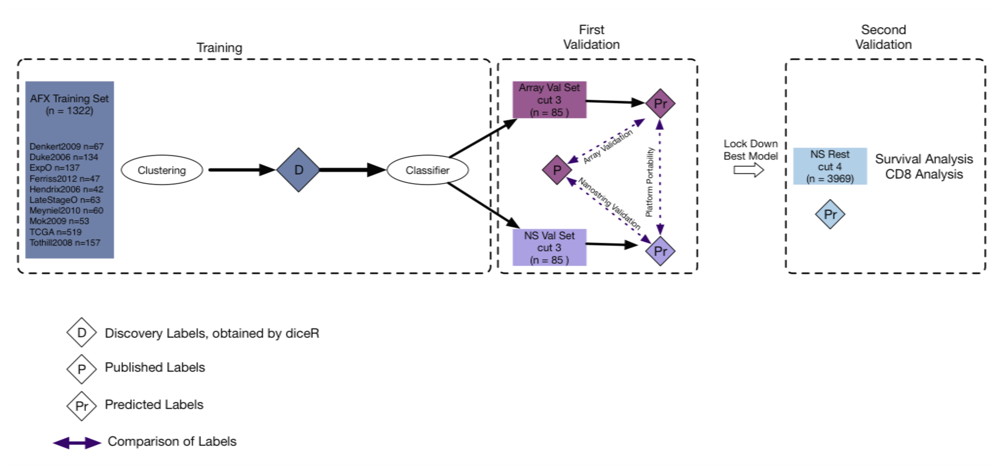

# PrOType

The Predictor of Ovarian Cancer Type

This repository contains all the data and scripts used to run the Vancouver analysis of the molecular subtypes of High Grade Serous Carcinoma.

## Introduction

This documentation will guide you through the process of running the full pipeline, which includes the following components:

1. **Unsupervised Learning**: use consensus clustering to determine HGSC subtypes using an unsupervised ensemble method
2. **Supervised Learning**: uses cluster assignments from previous step to classify new samples and learn the best supervised algorithm
3. **Post Processing**: validates top performing classifiers for different batch correction methods (XPN and CBT), and selects the
candidate model for predicting NanoString samples based on validating on overlap data
4. **NanoString Classifier**: uses candidate model to predict full NanoString data and output predicted subtypes
5. **Gene Selection**: select top genes based on training batch 1 of NanoString data and make final model predictions
6. **Cross Platform**: cross platform comparisons and evaluations

Please follow the manual below to run the pipeline on your system. Raw data can be provided upon request.

## Installation

### Docker

PrOType can be run in a preconfigured Docker container. This will allow for a reproducible environment across different machines and operating systems. To install docker on your machine see the official docs: https://docs.docker.com/install/

Once Docker is installed, navigate to the PrOType project directory on your machine then run

`docker image build -f Dockerfile -t protype:latest .`

to build the image on your machine (this may take some time). After the image has been built, you can start a container with

`docker run -it --rm protype:latest bash`

Inside the docker container, run `git clone https://github.com/AlineTalhouk/PrOType.git` and navigate to the `PrOType` directory. The `Dockerfile` is already configured with all the dependencies and tools you'll need to run PrOType. For more information on running docker containers, see the official docs: https://docs.docker.com/engine/reference/run/

### Packrat

We use `packrat` as a package management system to keep track of precise versions of all R package dependencies used in PrOType. After you have cloned PrOType to your local machine and open `PrOType.Rproj`, the packrat bootstrap installation will intialize. Run

`packrat::restore()`

to restore all packages listed in `packrat/packrat.lock` from their package sources in `packrat/src/` (this will also take some time).

The easiest way to run `PrOType` on a Linux server is to use `git` or `rsync` to copy the project to the server location, and then run the various `make` targets at the project root. This ensures that packages loaded from bash calls to `Rscript` use the packrat private library instead of the system library. To share the pipeline with a collaborator, send them the output of

`packrat::bundle()`

## Software Requirements

- Linux environment (distribution CentOS 5.4 was used)
- R version 3.5.1
- git
- GNU make

## Usage

Most of the PrOType pipeline is run using a Sun Grid Engine by distributing batch jobs to worker nodes via `qsub`, thus employing a parallel computing environment. To run the full pipeline, run `make all`. Separate sections of the pipeline can be run by running their respective make targets. See `Makefile` for all target names. The user is encouraged to run `make` in a terminal multiplexer such as `screen` or `tmux` so that computationally expensive operations can continue to run in an embedded server and not be killed by server timeouts.

The pipeline is broken into the following analyses:

- All Array Analysis
  - Unsupervised clustering using `diceR`
  - Supervised classification using `splendid`
  - Post-Processing
- NanoString Analysis
  - Full prediction of NanoString data
- Gene Selection
  - Reduced gene list
  - Predict final model
- Cross Platform

For a more detailed description of the pipeline, see [here](https://github.com/AlineTalhouk/PrOType/blob/master/docs/pipeline.md).

To use alternative options than the default pipeline parameters, modify the relevant fields in `Parameters.sh`. Read more about the various parameters [here](https://github.com/AlineTalhouk/PrOType/blob/master/docs/parameters.md).

## Additional Resources

A tree visualization of the file structure can be found [here](https://github.com/AlineTalhouk/PrOType/blob/master/docs/files.md). Helper functions, scripts for job submission, cleaning outputs, and additional developer parameters are found in the [`assets/`](https://github.com/AlineTalhouk/PrOType/tree/master/assets) directory.
