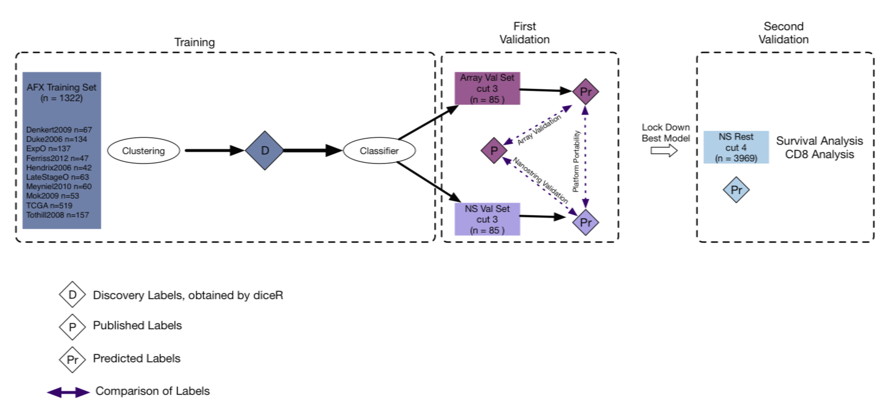

# PrOType

Molecular Classification of Ovarian Cancer

This is a repository of all the necessary scripts to run the Vancouver analysis of the molecular subtypes of High Grade Serous Ovarian Carcinoma. 

In order to successfully run the scripts on this repository you need to download the data folder (provided by us) to your local machine .

## Introduction

This documentation will guide you through the process of running the array classification pipeline, which entails the following:

1. `1_cluster_pipeline`: performs consensus clustering to determine HGSC subtypes using an unsupervised ensemble  method and performs supervised analysis to classify these subtypes, all of which are conducted in a computer cluster environment sequentially. 
2. `2_post_processing`: validates the top performing classifiers for different batch correction methods (XPN and CBT) and selects the candidate model to be used for prediction on Nanostring.

Please follow the manual below to run the pipeline on your system.

Data required by the pipeline is provided upon request.

# TODO: ------------------------

To reproduce the full analysis the scripts should be run in a sequential order as follows:

1. `array_classifier`: performs the unsupervised analysis on the array data and uses the discovery labels to train several models and perform the array validation above.
2. `nanostring_classifier`: performs the validation of the classifier on the NanoString data in the first validation and compares the labels. Subtype is assigned to the entire NanoString dataset.

# TODO: -----------------------------------

## Installation

### Docker

PrOType is able to run in a preconfigured Docker container.  This will allow for a repeatable environment accross different machines and computing environments.

To install docker on your machine see the official docs: https://docs.docker.com/install/

Once Docker is installed, navigate to `/PrOType` on your machine then run: `docker image build -f Dockerfile -t protype:latest .` 

to build the image on your machine.  This may take some time.  After this has finished, you can start a container with:

`docker run -it --rm protype:latest bash` 

For more information on running docker containers, see the official docs: https://docs.docker.com/engine/reference/run/

Now we just need the code!

Inside the docker container run `git clone https://github.com/AlineTalhouk/PrOType.git` and navigate inside the `PrOType` directory.

The Dockerfile is already configured with all the dependencies and tools you'll need to run PrOType.  You can now continue to the `Usage` section of this README.

## Usage

PrOType has a series of multi-step 'tasks',  (outlined below) that can be combined to perform the full analysis.

The tasks and their steps are as follows:

- Clustering
  - Unsupervised Clustering
  - Genemapping
  - Supervised
  - IV Summary
- Post Processing
- Nanostring Classification
- Reduced GeneList
- Final Nanostring Model

### Clustering

To run clustering, open the `Parameters.sh` file and edit the section for `Supervised, Unsupervised, and Data` parameters.  Once that is setup the way you want it, run `make clustering`.

### Post Processing

To run post-processing, open the `Parameters.sh` file and edit the section for ` Data` parameters, assuming you didn't configure them for `Clustering`. Once that is setup the way you want it, run `make post_processing`.

### Nanostring Classifier

To run post-processing, open the `Parameters.sh` file and edit the section for ` Data` parameters, assuming you didn't configure them for `Post Processing`.  Once that is setup the way you want it, run `make nanostring`.